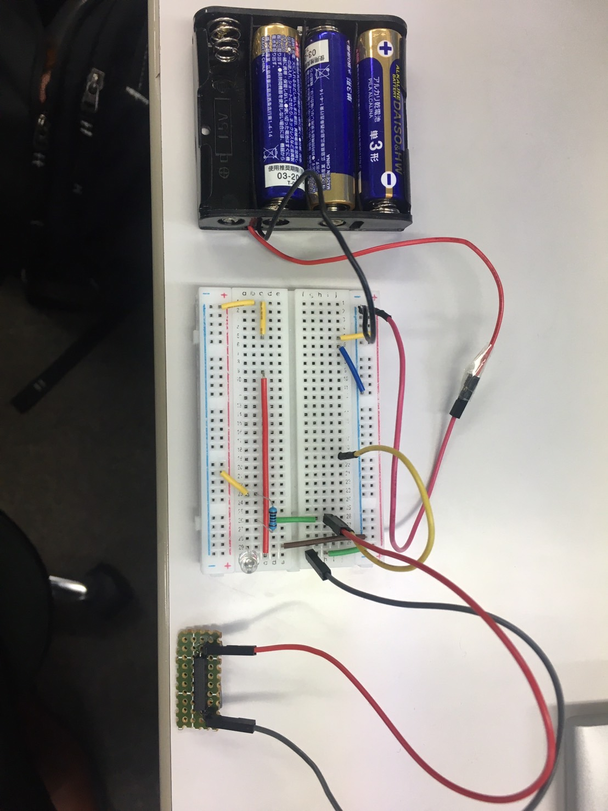

# DoorOpenCounter  

## 目次  
- [概要説明](#content1)  
- [リードスイッチの使い方](#content2)  
- [配線接続](#content3)
- [ESP32のセッティング](#content4)  
- [Raspberry Piのセッティング](#content5)  

<h2 id="content1">概要説明</h2>  

  

支店のプロジェクトルームのドアが開いた回数を記録する  

支店のプロジェクトルームのドアが開く  
↓  
リードスイッチが反応しESP32が起動  
↓  
ESP32からRaspberry PiへBluetooth接続  
↓  
Raspberry PiからDynamoDBへ現在時刻をMQTT送信   

<h2 id="content2">リードスイッチの使い方</h2>  

リードスイッチとは...  
```  
密閉されたガラス管内に2つの強磁性ブレードを含む電気機械式スイッチングデバイス  
```  

リードスイッチについて→参考サイト：https://standexelectronics.com/ja/reed-switch-technology-ja/what-is-a-reed-switch-and-how-does-it-work/  

- リードスイッチを利用して、LEDライトを点灯させる  
<br>
回路作成  

  
   

以下のサンプルソースをRaspberry Piで実行→[Rtest.py](./py/Rtest.py)    

```python
import RPi.GPIO as GPIO
import time

GPIO.setmode(GPIO.BCM)
GPIO.setup(2, GPIO.OUT)
GPIO.setup(14, GPIO.IN, pull_up_down=GPIO.PUD_UP)

while True:
    if GPIO.input(14) == 1:
        GPIO.output(2, GPIO.HIGH)
        print('OK')
    else:
        GPIO.output(2, GPIO.LOW)
        print('NG')

    time.sleep(0.5)
```  
リードスイッチに磁石を近づけると、LEDが点灯すればOK  

<h2 id="content3">配線接続</h2>  
ESP32とリードスイッチの配線図の配線を行う。  

  
  
