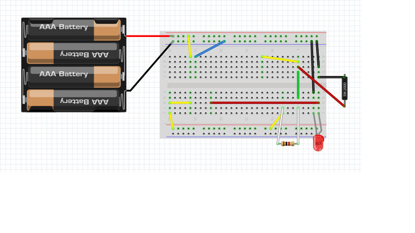

# DoorOpenCounter  

## 目次  
- [概要説明](#content1)  
- [リードスイッチの使い方](#content2)  
- [配線接続](#content3)
- [ESP32のコーディング](#content4)  
- [Raspberry Piのコーディング](#content5)  
- [残課題](#content6)  

<h2 id="content1">概要説明</h2>  

  

支店プロジェクトルームのドアが開いた回数を記録する  

支店プロジェクトルームのドアが開く  
↓  
リードスイッチが反応しESP32が起動  
↓  
ESP32からRaspberry PiへBluetooth接続  
↓  
Raspberry PiからDynamoDBへ現在時刻をMQTT送信   

<h2 id="content2">リードスイッチの使い方</h2>  

リードスイッチとは...  
```  
密閉されたガラス管内に2つの強磁性ブレードを含む電気機械式スイッチングデバイス  
```  

リードスイッチについて→参考サイト：https://standexelectronics.com/ja/reed-switch-technology-ja/what-is-a-reed-switch-and-how-does-it-work/  

- リードスイッチを利用して、LEDライトを点灯させる  
<br>
回路作成  

  
   

以下のサンプルソースをRaspberry Piで実行→[Rtest.py](./py/Rtest.py)    

```python
import RPi.GPIO as GPIO
import time

GPIO.setmode(GPIO.BCM)
GPIO.setup(2, GPIO.OUT)
GPIO.setup(14, GPIO.IN, pull_up_down=GPIO.PUD_UP)

while True:
    if GPIO.input(14) == 1:
        GPIO.output(2, GPIO.HIGH)
        print('OK')
    else:
        GPIO.output(2, GPIO.LOW)
        print('NG')

    time.sleep(0.5)
```  
リードスイッチに磁石を近づけると、LEDが点灯すればOK  

※プルアップ抵抗、プルダウン抵抗について  
  電子回路設計において、スイッチ入力を安定な状態に保つための抵抗  
  参考サイト→https://voltechno.com/blog/pullup-pulldown/  

  上のLEDを点灯させるために使用しているのがプルダウン抵抗  
  下のDoorOpenCounterで使用しているのがプルアップ抵抗  

  ちなみに上のLEDを点灯させるプルダウン抵抗をプルアップ抵抗にした場合  
  配線は下のようになる  
  
  これで上のソースを実行した場合  
  磁石が離れている場合→LED点灯  
  磁石を近づけた場合→LED消灯  
  となる  

<h2 id="content3">ENピンについて</h2>  
ESP32のENピンは、ESP32の再起動を行うためのピンである  
通常  
<br>
ESP32の電源ON  
↓  
setup()  
↓  
loop()  
<br>
の順で処理が行われ、loop()は電源がついている間処理し続けられるが  
このloop()中に電気信号が送られると  
<br>
ESP32の電源ON  
↓  
setup()  
↓  
loop()  
↓  
ENピンが信号をキャッチ  
↓  
setup()  
↓  
loop()  
<br>
のように、setup()の処理から行われる  

<h2 id="content3">配線接続</h2>  
ESP32とリードスイッチの配線図の配線を行う。  

  
  

このブレッドボードの上に下図のようにESP32を接続する。  
(今回はブレッドボードが小さかったため、ESP32の下にJump Wireを設置した)  

  
  

<h2 id="content4">ESP32のコーディング</h2>  

ESP32にソースをコンパイルするIDEの使い方については以下を参照する  
https://github.com/ksaplabo-org/ksapDoorOpener#content3  

ESP32からRaspberry PiへBluetooth接続を行うソース  
[bleak.ino](./ino/bleak.ino)  
<br>
～「bleak.ino」一部ソース説明～  
26~34行目：BLEの接続時、切断時のイベント処理  
54~56行目：LEDを点灯（ドアが開いている間LEDが点灯）  
76~78行目：ESP32をアドバタイズ状態に移行  
82行目   ：Bluetooth接続待ち  
87行目   ：Bluetooth接続が成功してから3秒待つ  
91行目   ：ESP32をDeepSleepモードにする  

ソースコードについて参考にしたサイトを示す  
https://taku-info.com/bleconnection-esp32andrpi/  

<h2 id="content5">Raspberry Piのコーディング</h2>  

Raspberry PiのOSセットアップ方法については以下を参考にする  
https://github.com/ksaplabo-org/Raspi-Setup  

Raspberry Piのターミナルで、pythonの「bleak」ライブラリをインストールする  
```
$ pip install bleak
```

「main.py」の11行目で
対象となるESP32のMACアドレスを指定すること  
MACアドレスの取得方法→https://mobile.k05.biz/e/2018/12/esp32-mac-addr.html  

Raspberry Piに以下のソースを移行し、ターミナルで「main.py」を実行する  
[main.py](./py/main.py)  
[blehandler.py](./py/blehandler.py)  
[logger.py](./py/logger.py)  

- 「main.py」  
  メイン処理  
  5秒周期で対象のESPを探し、見つけた場合blehandlerの処理に移行する  

- 「blehandler.py」  
  ESP32と接続を行うクラス  
  44行目でESP32とのBluetooth接続ができるまで待機し  
  できた場合、47行目のloggerクラスでMQTT通信を行う  
  
- 「logger.py」  
  現在時間をIoT Coreで作成したモノに向かってMQTT通信するクラス  
  35~41行目の固定値は、自分で作成したモノに応じて変更すること  

最終的な設置は以下のようになる  
   

<h2 id="content6">残課題</h2>  

- ドアを開けた時にESP32とRaspberry Piの接続が100%成功するわけではなく  
   50％くらいの確率で成功する  
- ESP32のENピンを利用しているため、ドアが閉まる前にLEDが消灯する   

<h2 id="content7">参考まとめ</h2>  
以下のサイトにESP32とRaspberry Piの接続についてまとめています。  
https://github.com/camelrush/esp32_samples/tree/master/esp32_ble_toRaspi  